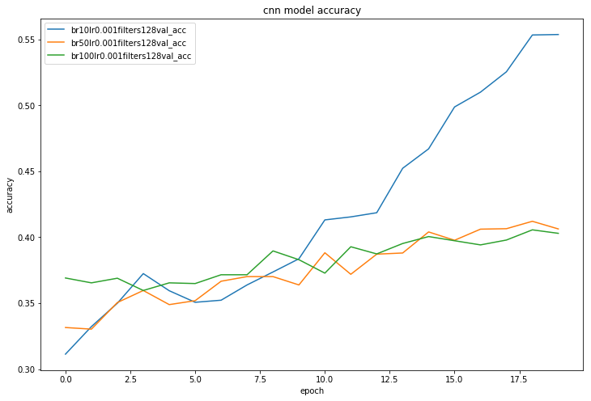

# Understanding Music using Deep Learning
## Introduction
Consider the following 3 songs:
<iframe src="https://open.spotify.com/embed/track/6or1bKJiZ06IlK0vFvY75k" width="240" height="80" frameborder="0" allowtransparency="true" allow="encrypted-media"></iframe>
<iframe src="https://open.spotify.com/embed/track/6fxVffaTuwjgEk5h9QyRjy" width="240" height="80" frameborder="0" allowtransparency="true" allow="encrypted-media"></iframe>
<iframe src="https://open.spotify.com/embed/track/4fzsfWzRhPawzqhX8Qt9F3" width="240" height="80" frameborder="0" allowtransparency="true" allow="encrypted-media"></iframe>

How do we determine which songs are similar and which are not alike? Intuitively, we know that Kanye's music is similar to Eminem's in ways that Ed Sheeran's is not. As humans, we use a variety of distinguishing factors such as artist, genre, tone, etc, based on information from lyrics and popularity, as well as musical information like rhythm, scale, timbre, pitch, chord progressions, and more. 

Computer systems that can process and understand music in this manner hold great value to music producers and consumers alike. Companies like Google, Apple, Spotify, Pandora, and dozens of others are all interested in retrieving information from music that would allow them to make better recommendations, and understand what types of music and listeners belong together. Historically, this information has been obtained from user and usage data-centric approaches [NEEDS CITATION]. We aim, however, to extract this information using audio features and lyrics of songs using deep learning. Specifically, we develop a model to classify songs by genre, identify their popularity, and to generate a latent embedding representation for each song, which we use to cluster songs and which can be used as a gauge for song similarity using cosine distance.

## Dataset
We are using the famous Million Song Dataset (MSD) and its complementary datasets for the project. The MSD itself provides a freely-accessible collection of audio features and metadata for a million contemporary popular music tracks. The feature analysis and metadata for the million songs are primarily provided by The Echo Nest. While the MSD does not provided audio samples it does provide derived audio features which we use. Furthermore, it provides various complementary datasets from which we retrieve lyrics, genre tags and usage data.

The dataset identifies a song by either *song_id* or *track_id*. One or the other is consistently used in the complementary datasets, which allows us to correctly preprocess the data. Given one of the id's we can then determine the song name and the artist. 

For our neural net we take Audio features and Lyrics as our input and Genre and Usage data as our output. 

## Audio Features
The audio features come with the MSD. Due to copyright issues, the MSD does not provide audio samples of songs but provides derived features such as chroma and MFCC features. We attempted to retrieve audio samples from 7digital which is a complementary dataset. However, 7digital does not hand out API keys anymore and we were unable the get the data. 
### Chroma Features
Chroma features give a way to represent the intensity of the twelve different pitch classes throughout a song. Generally, chroma features are used to capture harmonic and melodic characteristics of an audio signal such that they are not affected by a choice of instrument or timbre. The idea of pitch classes is that humans perceive notes to be similar when they are separated by an integral number of octave steps. Hence, we can split a pitch into two component: tone height and chroma. The set of the twelve chroma values, assuming the <a href>https://en.wikipedia.org/wiki/Equal\_temperament>equal tempered scale</a>, in western notation is given by:

      C, C#, D, D#, E, F, F#, G, G#, A, A#, B

Two pitches are said to be in the same pitch class if they are separated by an integral number of octavs. We can write for the chroma F:

    ..., F(-2), F(-1), F(0), F(1), F(2), ...

where two adjacent pitches are separated by one <a href="https://en.wikipedia.org/wiki/Octave">octave</a>.

To get the chroma features various techniques can be used. A common one is to use the short term fourier transform: We slide a window over a given song, and the audio signal within the window is transformed into frequencey space. In the frequency space we bin the frequencies into the corresponding chroma's and compute the intensity of the chroma accordingly (can be done in various ways). By moving the window over the song we then retrieve a timeseries dataset of chroma features. 

Here we show a few chroma plots of various songs:

INCLUDE IMAGES

The MSD dataset provides timeseries data of chroma features for up to 935 timesteps in a given song. The intensity of the chroma features is normalized, such that the maximum chroma feature has intensity 1.

We noted that not every song has $935$ timesteps and the majority of the songs had timesteps within the $300-400$ range. Hence, we truncated the data to have $300$ timesteps and discarded data with less than $300$ timesteps. 

TODO: ADD NUMBERS

### Timbre Segments
For a subset of the songs, the MSD provides timbre information. For a given song, they provide timeseries data with twelve dimensional feature vectors encoding information about timbre during the given segments of a song. 

Timbre is an important feature for music information retrieval and genre classification. Timbre describes the perceived sound quality of a musical note, sound or tune -- e.g., a sound played at the same pitch and loudness can sound very different across instruments. Timbre is also what allows humans to differentiate between instruments and voices.  

The timbre features are usually computed by retrieving the <a href="https://eprints.soton.ac.uk/361426/1/EUSIPCO_2012.pdf">Mel-frequency Cepstral Coefficients</a> and by taking the twelve most representative components. To understand the data better we plotted timbre feature for various songs:

Like with the chroma features, while the timeseries can be up to $935$ timesteps long, most songs will have only 300-400 timesteps available. Hence, we truncate after the first 300 steps and only consider songs with more than 300 steps.
## Lyrics
## Task at hand
### Usage Data
### Genre
Due to the difficulties in working with usage data and the problems faced with collaborative filtering, we instead decided to focus directly on a task that would allow our model to focus on actual musical features, i.e., attempt to learn a label or representation of a song that would encourage our model to focus on musical features. The most natural candidate label for such a task is song genre - genre is very often a proxy for features like chord progressions, rhythm, timbre, and many more. Since our dataset was very large, we decided to focus on the 100,000 most popular songs, which fell into 18 different genres:
INCLUDE NUMBER OF SONGS PER GENRE HERE
We trained our models to classify songs based on their genre in these 18 classes, using the lyric data and 2 audio features as input.
### Popularity
Humans are pretty good at predicting genre - most people who listen to a large enough variety of music can eventually figure out what different genres sound like, at least roughly. Though automated genre classification is an immensely useful task, we sought to see whether our models could also learn to predict features that are difficult for humans to understand as well. In particular, we trained our models to predict popularity of music, by determining which percentile of music a particular song fell into (ranked by number of listens). We formulated this as a classification problem with 1 bin for each 10th percentile (10 classes).
## Models
### Baseline: Fully Connected Network
To compare our models to a baseline, we train a simple fully connected neural network with 3 hidden layers of dimensions 128, 128, and 50 respectively, followed by a softax layer of dimension 18 to predict genre. Here is a model of our Fully Connected Network:

### CNN: 
This model was based off the model used by <a href="https://papers.nips.cc/paper/5004-deep-content-based-music-recommendation">van den Oord et al</a>. For each audio feature input data of dimension (300, 12), we had a 1 dimensional convolution over time steps, followed by max pooling repeated 3 times. We then performed Global temporal pooling to produce a 1 dimensional vector for each audio feature, which we concatenated together. Our significant change in this layer was to remove the global L2 and global max pool, which we did in order to reduce redundancy of our model and decrease overfitting. To this vector, we also concatenated the sentence embedding of our bag of words of lyric data. We then passed this output through 3 hidden layers with the same architecture as our baseline model. Here is a visualization of our CNN: 

### LSTM:

## Results
<iframe width="900" height="620" seamless="seamless" frameBorder="0" scrolling="yes" src="Pictures/PlotlyPlots/tsne-scatter-genre.html"></iframe>

      
## Tools
The software tools we used for this project were:
1. Keras - We used Keras to construct, train, and evaluate our neural nets. We found the Functional API particularly useful because it allowed us to create a modular architecture while using readily available layers, so we had to define only one layer of our own construction.
2. Numpy - We used numpy to do the heavy lifting of data processing, encoding, etc.
3. Scikit-learn
4. Pandas - Pandas was a useful tool for organizing and processing our dataset which was very spread out.
Our code can be found <a href="https://github.com/daniellengyel/music-cs182/">here</a>

## Conclusions and Key takeaways

## Future Directions

