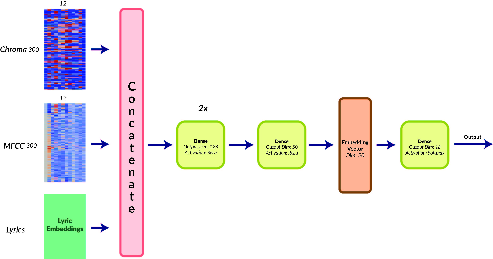
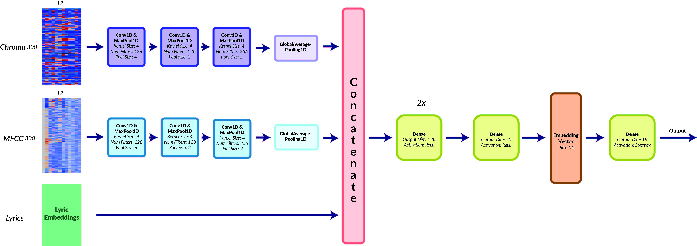
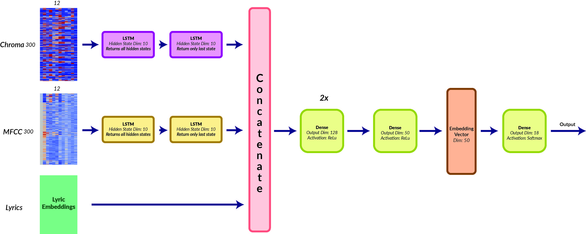
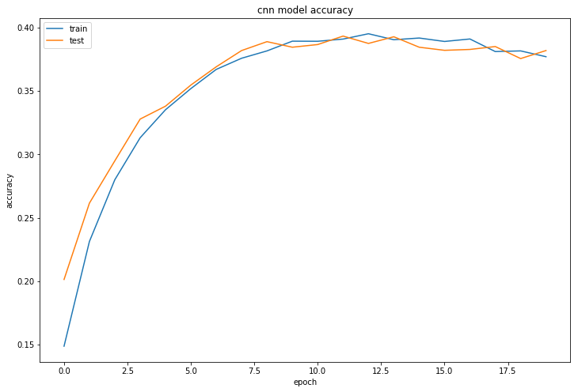
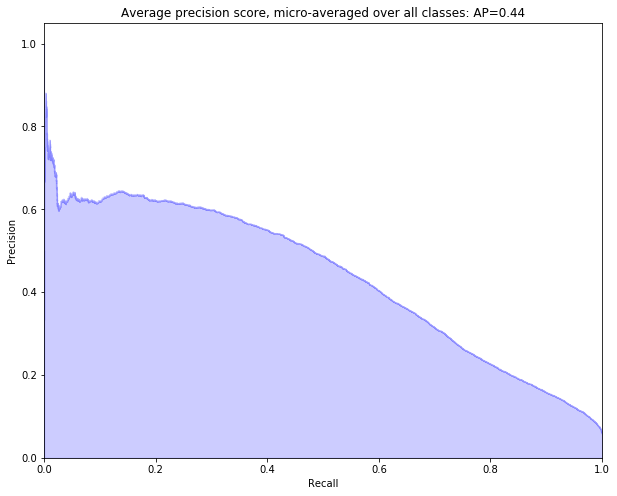
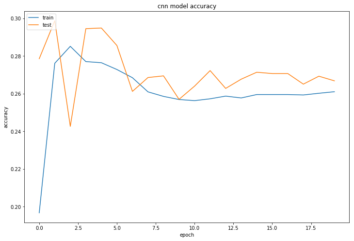
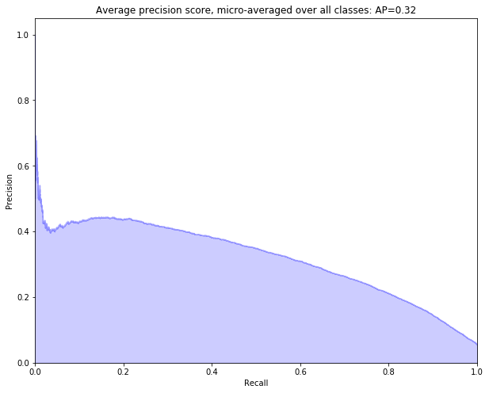
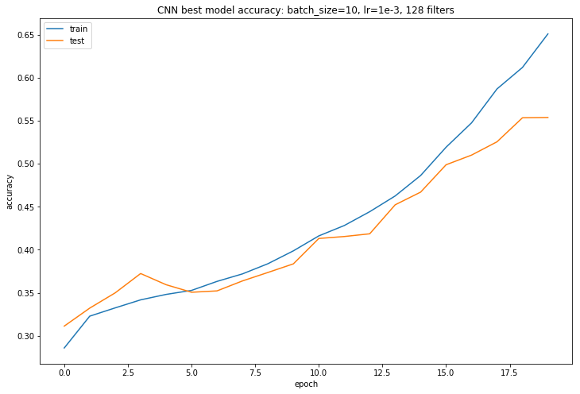
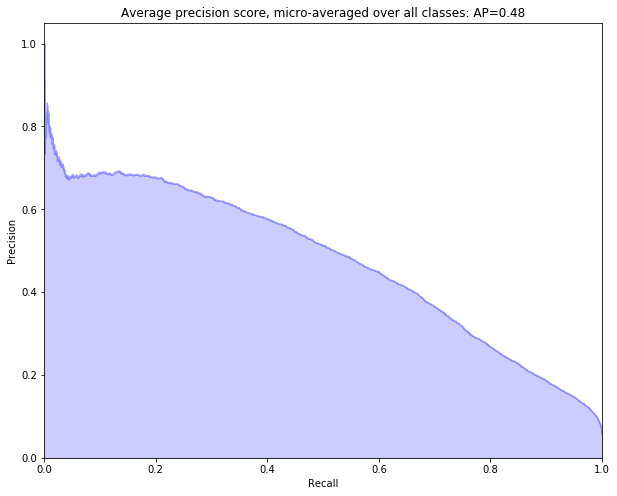
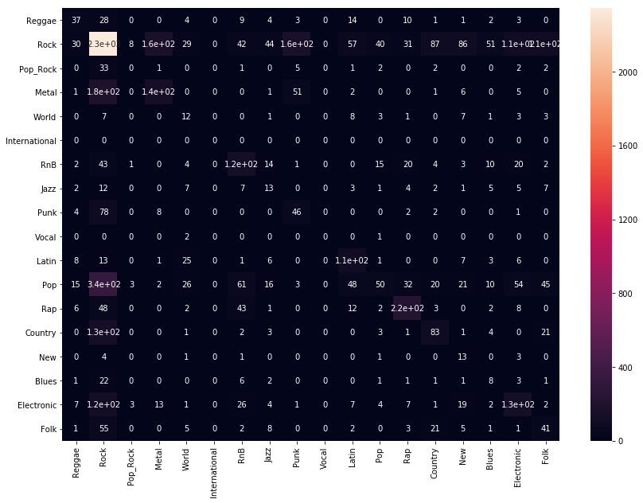

# Understanding Music using Deep Learning
## Introduction
Consider the following 3 songs:
<iframe src="https://open.spotify.com/embed/track/6or1bKJiZ06IlK0vFvY75k" width="240" height="80" frameborder="0" allowtransparency="true" allow="encrypted-media"></iframe>
<iframe src="https://open.spotify.com/embed/track/6fxVffaTuwjgEk5h9QyRjy" width="240" height="80" frameborder="0" allowtransparency="true" allow="encrypted-media"></iframe>
<iframe src="https://open.spotify.com/embed/track/4fzsfWzRhPawzqhX8Qt9F3" width="240" height="80" frameborder="0" allowtransparency="true" allow="encrypted-media"></iframe>

How do we determine which songs are similar and which are not? Intuitively, we know that Kanye's music is similar to Eminem's in ways that Ed Sheeran's is not. As humans, we use a variety of distinguishing factors such as artist, genre, tone, etc, based on information from lyrics and popularity, as well as musical information like rhythm, scale, timbre, pitch, chord progressions, and more. 

Computer systems that can process and understand music in this manner hold great value to music producers and consumers alike. Companies like Google, Apple, Spotify, Pandora, and dozens of others are all interested in retrieving information from music that would allow them to make better recommendations, and understand what types of music and listeners belong together. Historically, this information has been obtained from user and usage data-centric approaches such as collaborative filtering [9]. We aim, however, to extract this information using audio features and lyrics of songs directly using deep learning. Specifically, we develop a model to classify songs by genre and to generate a latent embedding representation for each song, which we use to cluster songs and which can be used as a gauge for song similarity. We choose genre for learning song embedding, since it is is very often a proxy for features like chord progressions, rhythm, timbre, and other musical features. 

## Problem statement and Success Metric
We aim to predict genre labels and create latent embedding representations of songs given audio features and lyrics. To do so we develop three different deep learning models: 1) Baseline Dense Network, 2) Convolutional Neural Network 3) LSTM. Each network will output an array which contains a logit for each genre and has a layer which contains a 50 dimensional latent embedding representation of the song. 

To measure our success we will evaluate our genre predictions and observe the latent embedding space generated by our models. To evaluate genre predictions, we use: accuracy, confusion matrices, precision and recall (Average precision over all classes), and F1 score. While the dataset which is used for this project,  the Million Song Dataset (MSD), is a common dataset for Music Information Retrieval (MIR) tasks, there does not seem to be a standard method to compare our models with other research. Therefore, we will base our success off how well our models compare to our naive baseline. 

For the latent embedding spaces we are mostly looking for a space which captures song similarity well -- i.e. songs which are generally recognized to be similar are expected to be clustered. If we find such a space, then we have achieved our task of retrieving information about songs. We can now take a new song with no prior listens and compare it to other songs solely based on its audio features and lyrics. 

Our best performing model achieved 55% accuracy at 16 genre classification, which was significantly better than our baseline model. We also note that we performed better than the 36% obtained by <a href="http://dawenl.github.io/files/FINAL.pdf" >this project from CMU</a> who worked on the same dataset with a similar problem statement but with a different subset. We were also able to generate song embeddings, which were both useful and learned interesting features -- e.g. our model discovered that songs by latin singers are close to each other even though they may belong to different genres. We also discoved that our model often cross-classies rock, punk and metal, which is to be expected since songs from these genres may be very similar and a human may have troubles discerning them.

We note that genre classification given audio data [1] or lyric data [8] and genre embeddings from genre classification are well studied research problems due to their importance in recommendation systems. However, to the best of our knowledge, all three have not been attempted on the Million Song Dataset (MSD) simultaneously. 

## Dataset
We are using the famous Million Song Dataset (MSD) and its complementary datasets for the project. The MSD itself provides a freely-accessible collection of audio features and metadata for a million contemporary popular music tracks. The feature analysis and metadata for the million songs are primarily provided by The Echo Nest. While the MSD does not provided audio samples it does provide derived audio features which we use. Furthermore, it provides various complementary datasets from which we retrieve lyrics and genre tags.

The dataset identifies a song by either *song_id* or *track_id*. One or the other is consistently used in the complementary datasets, which allows us to correctly preprocess the data. Given one of the id's we can then determine the song name and the artist. 

For our neural net we take Audio features and Lyrics as our input and Genre and Usage data as our output. After all preprocessing is done we had 32,648 song which had all necessary features.

### Audio Features
The audio features come with the MSD. Due to copyright issues, the MSD does not provide audio samples of songs but provides derived features such as chroma and MFCC features. We attempted to retrieve audio samples from 7digital which is a complementary dataset. However, 7digital does not hand out API keys anymore and we were unable the get the data. 

The derived audio features are provided as timeseries data of up to 935 timesteps in a given song. We note a few things:

* Not every song has 935 timesteps and the majority of the songs had timesteps within the 300-400 range. Hence, we truncated the data to have 300 timesteps and discarded data with less than 300 timesteps.

* There is generally no gurantee that the timesteps have the same timelength within a song or between songs. While we  observed that the maximum time of a timesteps is 5 seconds, roughly 99% of all timelengths are less than or equal to one second. A timelength of 1 second is roughly small enough such that we can treat the samples as the same -- which we did moving forward. 
   
* All audio features timeseries start at the begining of their respective songs. 

#### Chroma Features
Chroma features are used to represent the intensity of the twelve different pitch classes throughout a song. In other words, chroma features are used to capture harmonic and melodic characteristics of an audio signal such that they are not affected by a choice of instrument or timbre. The idea of pitch classes is that humans perceive notes to be similar when they are separated by an integral number of [octave](\href{https://en.wikipedia.org/wiki/Octave) steps. Hence, we can split a pitch into two component: tone height and chroma. The set of twelve chroma, assuming the [equal tempered scale](https://en.wikipedia.org/wiki/Equal\_temperament), in western notation is given by:

    C, C#, D, D#, E, F, F#, G, G#, A, A#, B

Motivated by how humans preceive pitch, two pitches are said to be in the same pitch class if they are separated by an integral number of octavs. We can write for the chroma F:

    ..., F_{-2}, F_{-1}, F_{0}, F_{1}, F_{2}, ...

where two adjacent pitches are separated by one octave.

To get the chroma features various techniques can be used. A common one is to use the short term fourier transform: We slide a window over a given song, and the audio signal within the window is transformed into frequencey space. In the frequency space we bin the frequencies into the corresponding chroma's and compute the intensity of the chroma accordingly (can be done in different ways, e.g. average). By moving the window over the song we then retrieve a timeseries dataset of chroma features. 

We note that the intensity of the chroma features is normalized, such that the maximum chroma feature has intensity 1.

#### Timbre Segments
For a subset of the songs, the MSD provides timbre information. For a given song, they provide timeseries data with twelve dimensional feature vectors encoding information about timbre during the given segments of a song. 

Timbre is an important feature for music information retrieval and genre classification. Timbre describes the perceived sound quality of a musical note, sound or tune -- e.g., a sound played at the same pitch and loudness can sound very different across instruments. Timbre is also what allows humans to differentiate between instruments and voices.  

The timbre features at every timestep are usually computed by retrieving the Mel-freqeuncy Cepstral Coefficients (MFCC) [6] and by taking the twelve most representative components. In the remainder of the paper we use timber and MFCC interchangably. 

Due to how the timber segments are calculated, the timber feature vector at every timestep does not have a clear interpretation unlike the chroma features. Also, the maximum value of a component of the timber feature vector at a timestep generally depends on the song and is not normalized.

#### Visualization
We plot the visualization of both the chroma and timber segment timeseries as a heatmap for various songs. While timber features are less interpretable than chroma, we plot them anyway to have a better idea of the data. 

Given the interpretability of chroma feature values we notice for example: Party in the USA has many changes in the intensity of chroma values while Hotel California does not. Such a pattern indicates that Party in the USA has a more energetic start while Hotel California starts slower (notably with the famous slow guitar solo). 

We also provide song snippets for ease of use. Unfortunately, Spotify does not allow us to choose the time interval of the song. So, the songs do not overlap with the interval of the features but should serve as a reminder for the general feel of the song. 

##### Miley Cyrus: Party in the USA

<iframe src="https://open.spotify.com/embed/track/5Q0Nhxo0l2bP3pNjpGJwV1" width="300" height="80" frameborder="0" allowtransparency="true" allow="encrypted-media"></iframe>

There is a clear pattern in how the pitch with the highest intensity evolves. The maximum pitch spikes periodically and frequently. Furthermore, the intensity of various pitches change quickly and often, indicating a high energy song. 

Notice that at every timestep many pitches are registered simultaneously. While we expect the maximum pitch at every timestep to be Miley Cyrus' voice, the other pitches are most likely attributed to the many sound effects in the song. 

<iframe width="700" height="400" seamless="seamless" frameBorder="0" scrolling="yes" src="Pictures/PlotlyPlots/chroma_Party In The U.S.A._Miley Cyrus.html"></iframe>

<iframe width="700" height="400" seamless="seamless" frameBorder="0" scrolling="yes" src="Pictures/PlotlyPlots/timber_Party In The U.S.A._Miley Cyrus.html"></iframe>

##### Beyoncé: Halo

<iframe src="https://open.spotify.com/embed/track/4JehYebiI9JE8sR8MisGVb" width="300" height="80" frameborder="0" allowtransparency="true" allow="encrypted-media"></iframe>

Halo starts with slower changes in pitches and picks up the pace at the 10 seconds mark. We notice that the pitch with the highest intensity changes slower than in Party in the USA and also see a smoother pattern of rising and falling maximum pitch. In contrast to Party in the USA, we expect Halo to be a slower paced song -- agreeing with what we hear. 

<iframe width="700" height="400" seamless="seamless" frameBorder="0" scrolling="yes" src="Pictures/PlotlyPlots/chroma_Halo_Beyoncé.html"></iframe>

<iframe width="700" height="400" seamless="seamless" frameBorder="0" scrolling="yes" src="Pictures/PlotlyPlots/timber_Halo_Beyoncé.html"></iframe>

##### Eagles: Hotel California 

<iframe src="https://open.spotify.com/embed/track/40riOy7x9W7GXjyGp4pjAv" width="300" height="80" frameborder="0" allowtransparency="true" allow="encrypted-media"></iframe>

For Hotel California we can observe exactly where the guitar solo ends. Note that before the 50 seconds mark, for every timestep there seems to be mostly only one clear pitch. This pitch can be attributed to the guitar solo as fingerpicking the guitar will produce mostly one clear pitch (note, playing the pitches on an instrument mod octave will reproduce the solo). After the 50 seconds mark, the other instruments begin to play. This start is evident by noting several other pitches besides the maximum intensity pitch. 

<iframe width="700" height="400" seamless="seamless" frameBorder="0" scrolling="yes" src="Pictures/PlotlyPlots/chroma_Hotel California_Eagles.html"></iframe>

<iframe width="700" height="400" seamless="seamless" frameBorder="0" scrolling="yes" src="Pictures/PlotlyPlots/timber_Hotel California_Eagles.html"></iframe>

### Lyrics
Lyrics provide important features for the uniqueness and relative similarities of songs. By looking into lyrics content as a sequence of words, we aim to evaluate the content of lyrics to help identify the style and classification of each song and use it to match most similar songs in related genres. 

We retrieved the lyrics data from the complementary musiXmatch dataset. The lyrics are given in a Bag-of-Words representation, so we try summarize the information of each lyric into a single embedded vector. To do so, we find the precomputed Word2Vec embedding vector for each single word and take a weighted sum, weighted by the fraction of total occurances of the word in the lyric, of each word embedding to retrieve a general embedding vector representation of the song. 

The advantage of using above the weighted sum method is its simplicity and efficiency. One disadvantage is that it is not comprehensive enough to evaluate the importance by the frequency of its appearance. High frequency words may be semantically important (e.g. love) or unimportant (e.g. the). Our bag of words representation also prevents us from taking advantage of word ordering in sentences (which we could have done using methods like attention). This however, is unavoidable due to copyrights on lyric data, which allow us only to obtain a bag-of-word representation. This may be mitigated in our situation by the fact that lyrics are often very repetetive, so a bag of words representation may not be so bad after all.

It has been shown [4] that averaging the embeddings of words in a sentence is a surprisingly successful and efficient way of obtaining sentence embeddings. [3] used a similar weighted sentence embedding method to achieved a decent result for Plagiarism Detection. They showed the effectiveness of such method in detecting similarities between sentences.  

### Genre
We retrieved the genre labels from the tagtraum complementary dataset. The labels fell into the following 18 genres:

      Vocal, Punk, Rock, Country, Blues, New, World, Reggae, Jazz, Folk, RnB,
      International, Pop_Rock, Electronic, Metal, Rap, Pop, Latin
      
Since our dataset was very large, we decided to focus on the 100,000 most popular songs, for which we only found 32,648 songs with a genre label. Furthermore, around 45% of the labels fell into the rock category as we can see in the following plot:

<iframe width="900" height="620" seamless="seamless" frameBorder="0" scrolling="yes" src="Pictures/PlotlyPlots/genre_histogram.html"></iframe>

We deal with this class imbalence in the following Data Preprocessing section. 

## Data Preprocessing
Most of the initial challanges for data preprocessing were to gather all features from the complementary datasets of the MSD. These datasets are spread out accross multiple website and are provided by different agencies. Most complementary datasets also only provide data for a subset of the songs in the MSD, so we needed to ensure that our final dataset has features and a corresponding label for every song. Taking the intersection of all datasets significantly reduced our final dataset to **32,648**. 
Since the full dataset was several hundreds of gigabyte large, we also needed to do all data cleaning and gathering on a cloud instance. 

Once we had a cleaned dataset, we started to explore and notice that our genres were unbalanced. Hence, our main data preprocessing technique was under and oversampling.

### Under and Oversampling
During data preprocessing and cleaning we noticed that the number of samples for each genre label were unbalanced. Since around 45% of our dataset is 'rock' labeled our model will easily achieve artificial high accuracy of 45% by always predicting 'rock'. Only when plotting the confusion matrix will it become obvious that our model is not performing as desired. 

To combat this behaviour we used the simple yet powerful technique of over and under sampling as done [2]. Before using the technique, we removed two of the genres which had less than 10 samples in the dataset: Vocal and International. 

To balance the classes, we decided to sample 4,000 times with replacement for the rock dataset and sample 1,000 times with replacement from each other genre subset. We decided to retain more rock samples because we believe that the reason many samples are labeled as rock is because most music sounds vaguely similar to rock. Hence, when allowing the model to train very well on rock, we believe that the model will better learn to classify other genres by only having to notice minor differences in the features. This reasoning follows the motivation for transfer learning, where training on one task makes it easier to train for a related task. 

## Models
Our goal is to predict genre given song features. The input to the model will consist of derived audio features, Chroma and MFCC (Timber Segments) and our lyric embeddings. The output will be a 18 dimensional logits vector to classify genre (note that due to Data Preprocessing, we are actually working over 16 genres). 

For each model we also included an embedding layer which we later visualize. Since we train our model to predict genre, we expect the embedding layer to cluster songs in the same genre.  

We train our models end to end using Adam. Initially, we faced problems of overfitting in our CNN model. We combated this by using the correct over/undersampling technique and by using l1 and l2 norm for all the dense layers. We considered adding more features to prevent overfitting, such as Dropout, but we were already able to obtain validation results that matched our training results.

### Baseline: Fully Connected Network
To compare our models to a baseline, we train a simple fully connected neural network with 3 hidden layers of dimensions 128, 128, and 50 respectively, followed by a softax layer of dimension 18 to predict genre. Here is a model of our Fully Connected Network:

### CNN: 
Our CNN model was motivated by the model used by [7, 1]. For the audio features, both Chroma and MFCC, with dimension (300, 12), we had a 1 dimensional convolution over time steps followed by max pooling -- repeated 3 times. We then performed global average temporal pooling to produce a 1 dimensional vector for each audio feature, which we concatenated together. Compared to van den Oord's model, we removed the global L2 and global max pool to reduce redundancy of our model and decrease overfitting. To this vector, we also concatenated the lyric embeddings. We then passed this concatinated vector through 3 hidden layers with the same architecture as our baseline model. 

### LSTM:
The LSTM was motivated by [8] who achieved great results on a different dataset. For each audio feature we use a two layer LSTM with hidden state dimension of 10. For each audio feature, we then pass the output of the last cell of the second layer into the concatenation vector. We also concatenate the lyric embeddings to the concatenation vector and then proceed as described in the baseline model. We did not add regularization since we observed that the model did not tend to overfit – something we may attribute to our data preprocessing techniques. 

## Results
### Genre Classification
Here we present our results at our main task - classifying songs by genre. We partition our songs into a train and test set (of sizes 26k, 6k respectively) using sklearn after shuffling to mix up genres. For validation, we use keras' built in partitioning to create a validation set with a split of 0.3.

The metrics we primarily concerned ourselves with were accuracy, precision and recall (Average precision over all classes), and F1 score.

First, to understand the results from our LSTM and CNN model, we look at how a baseline full connected net performs on our data. This is how our training and validation accuracy look:

Not too bad - even this basic model seems to be learning something, which is promising for us. We see test and training accuracy of about 40%. 

Let's look at our model's precision and recall curve - even though we balanced our classes in the data, accuracy is not always the best metric for our model's success.

Our baseline has an average precision of 0.44 over 18 classes, with an F1 score of 0.42.

We now look at our LSTM Model. One of the problems we faced with our LSTM was that it was much slower at both training and inference - it took on the order of 20x as long to train and infer. Here we show our results:

Our model had an accuracy of ~30%. This varied between training runs, and we occasionally were able to get it to the range of 40-45% with a smaller batch size.

The LSTM model had an average precision of 0.32, which is worse than our baseline. In addition, it had a (not bad) F1 score of 0.48. One explanation for why our model didnt work is that it may not have been well fitted to this type of data - perhaps convolutions are a better way of analyzing our particular data due to the locality of temporal correlations - at any given timestamp, the immediately neighbouring timestamps may be more important than more distant steps. 

Though our model on average performed worse than our baseline, a large part of this was due to our difficulty training it - we didn't have time to optimize over hyperparameters. Perhaps hyperparam training and tweaking with the model (for example, adding attention) could increase its performance. This theory has evidence in the form of results from [8] who were able to obtain up to 50% accuracy on a different dataset with 20 genres, trained only on lyric data.

Our best results were from our CNN Model, using a batch size of 10, 20 epochs, a learning rate of 1e-3, and 128 conv filters per layer (except the last one, which had 256 filters). The training and validation accuracy is presented below:

This is a considerable improvement over the baseline model and the LSTM model, with a validation/test accuracy of 50-55%. Further, we look at the Precision and recall:

Our model had an F1 score of 0.52 and an average precision of 0.48, significantly better than the LSTM and the baseline.

We also looked at the confusion matrix for our best performing model, the CNN model:

This matrix has mixed but reasonable results. We do see an overall diagonal structure. Some genres are well identified - Rock, RnB, Latin, Rap, New Age, and Electronic. We also see that songs labelled in Punk and Metal are often classified as Rock, (or eachother), indicating that our model learns that these genres are musically similar. Our confusion matrix shows that our model often classifies many models as Rock by default - this was a problem we faced even more prominently until we downsampled rock in our dataset. This could also result from teh fact that 'Rock' as a label is musically very diverse - bands like the Beatles and AC/DC sound very different but could both be classified as Rock. Nevertheless, the diagonal structure of our confusion matrix is promising for our model.

### Latent Embedding Representation: t-SNE
We plot the **CNN** embedding vectors of 3,000 songs with t-SNE. We can clearly see a clustering of the songs which we consider a success considering the problem statement.

Surprisingly, our model also picked up on other interesting song characteristics. While the cluster around (70, -10) has Pop, Rock, and Latin mixed, the majority of the songs appear to be by Latin singers. An interesting further direction would be to evaluate which features contribute to this clustering and which parts of the model are activated most when given such songs. 

<iframe width="900" height="620" seamless="seamless" frameBorder="0" scrolling="yes" src="Pictures/PlotlyPlots/cnn-tsne-scatter-genre.html"></iframe>

      
## Tools
The software tools we used for this project were:
1. Keras - We used Keras to construct, train, and evaluate our neural nets. We found the Functional API particularly useful because it allowed us to create a modular architecture while using readily available layers, so we had to define only one layer of our own construction.
2. Numpy - We used numpy to do the heavy lifting of data processing, encoding, etc.
3. Scikit-learn
4. Pandas - Pandas was a useful tool for organizing and processing our dataset which was very spread out.
Our code can be found <a href="https://github.com/daniellengyel/music-cs182/">here</a>
To train our models, we used an AWS p2.xlarge instance, with a Tesla K80 GPU. In addition, we made use of the publicly hosted EBS copy of the Million Song Dataset.
We also used Google Cloud extensively towards our earlier collaborative filtering approach.

## Conclusions

### Key takeaways
We were able to obtain 55% accuracy at 16 genre classification using our CNN Model, with an average precision of 0.48, in a result that performed significantly better than our baseline model. We were also able to generate song embeddings, which are useful as a tool for understanding song similarity and can be used for tasks such as playlist generation and music recommendation. Our song embeddings formed a useful space, which when visualized, clearly clustered songs by genre and artist. We noticed some interesting and surprsing features of our embedding space. For example our model discovered a cluster that has mixed music from the Pop, Rock, and Latin genres, with the majority of the songs appearing to be by Latin singers. We also found that our model often has cross-classifications between rock, punk and metal, which we expect since they are very similar (often the same) genres of music.

### Future Directions
It would be interesting to study the effect of including and excluding different parts of the data - for example, training a model on only lyrics, or only the audio features. This would allow us to determine which parts of our data are most useful, and whether all of them are neccessary. This would be informative, because knowing which parts of our data are more relevant would allow us to build more specific models to take advantage of the data.

It would also be interesting to analyze the embedding space more. How do the songs stand in relation to another, are any more features encoded in the embeddings space? The clustering of Latin songs could be further explored as well –- i.e. looking at which features and which filters of the CNN model create the clustering. 

It would also be interesting to try out more optimizers, although we found reasonable success using SGD and Adam.

### Other work done for this project 
We started the project by attempting to build a model which learns a mapping from audio features and lyrics to a song's representation in the collaborative filtering space [9]. A very useful model when attempting to recommend songs with a low number of plays. Our approach was motivated by [7] to which we aimed to contribute by including lyric data as feature input. 

The usage data from the million song dataset proved to be difficult to work with. We attempted to obtain the collaborative filtering space by using the Spark Alternating Least Squares algorithm with implicit feedback from [5] on a Google Cloud instance. However, even after an exhaustive hyper-parameter search we were unable to produce a collaborative filtering space which was reasonable: Rudolph the red nosed reindeer and a heavy metal song were closest neighbors. Since the authors did not elaborate on the collaborative filtering space they found in their paper, we decided to reached out. They haven't responded yet. Since our results seemed inappropriate and we could not find how a correct collaborative filtering space should look like, we decided to pivot on our problem statement. 

To make use of the work we put forward on the usage data, we also wanted to predict number of plays of a song given audio features and lyrics. We reasoned that humans are pretty good at predicting genre - most people who listen to a large enough variety of music can eventually figure out what different genres sound like, at least roughly. Though automated genre classification is an immensely useful task, we sought to see whether our models could also learn to predict features that are difficult for humans to understand as well. In particular, we trained our models to predict popularity of music, by determining which percentile of music a particular song fell into (ranked by number of listens). We formulated this as a classification problem with 1 bin for each 10th percentile (10 classes). However, we were not able to achieve a better result than random classification and the embedding space which we learned similarly to the genre classification task appeared random as well. Therefore, we decided to solely focus on genre classification. 

## Team Contributions

Dhruv (38%): Acquired full MSD, Data preprocessing (genre data, usage data, audio feature data), built CNN, LSTM and baseline model, trained models, generated embeddings, set up and wrote content for website, calculated metrics and plots for model evaluation.

Daniel (38%): Set up codebase, Data preprocessing (genre data, usage data, audio feature data), built LSTM model, wrote content for website, t-SNE plotting, audio exploration and visualization, Model visualization diagrams.

Wayne (24%): Processed and generated lyric embeddings from BoW representation, wrote Lyric section for website, Audio preprocessing.

## References

[1] Y. MG Costa, L. S. Oliveira, and C. N. Silla. An evaluation of convolutional neural networks for music classification using spectrograms. Applied Soft Computing, 52:28–38, 2017.

[2] A. Fern, S. Garc, F. Herrera, N. V. Chawla. SMOTE for Learning from Imbalanced Data: Progress and Challenges. Journal of Artificial Intelligence Research 61 863-905. 2018.

[3] J. Ferrero, F. Agnès, L. Besacier, D. Schwab. (2017). Using Word Embedding for Cross-Language Plagiarism Detection. 10.18653/v1/E17-2066. 

[4] T. Kenter. Siamese CBOW: Optimizing Word Embeddings for Sentence Representations. arXiv:1606.04640

[5] Y. Koren, R. Bell, C. Volinsky. Matrix Factorization Techniques for Recommender Systems. IEEE Computer Society Press Los Alamitos, CA, USA. 2009.

[6] F. de Leon, K. Martinez. ENHANCING TIMBRE MODEL USING MFCC AND ITS TIME DERIVATIVES FOR MUSIC SIMILARITY ESTIMATION. 20th European Signal Processing Conference (EUSIPCO). 2012

[7] A. van den Oord, Sander Dieleman, Benjamin Schrauwen. Deep content-based music recommendation. Advances in Neural Information Processing Systems 26 (NIPS). 2013.

[8] A. Tsaptsinos. LYRICS-BASED MUSIC GENRE CLASSIFICATION USING A HIERARCHICAL ATTENTION NETWORK, 18th International Society for Music Information Retrieval Conference, Suzhou, China. 2017.

[9] X. Yang, Y. Guo, Y. Liu, H. Steck. A survey of collaborative filtering based social recommender systems. Computer Communications Volume 41, 15 March 2014, Pages 1-10. 2013.

